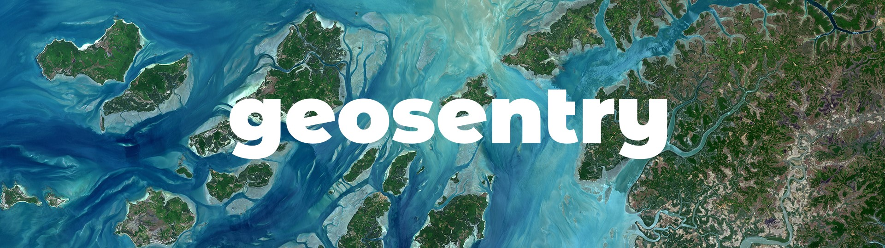

# GeoSentry Console 🌍

Frontend Web Console for the GeoSentry🌍 Platform developed with Flutter and Dart and powered by a Firebase Backend.

**Version: 0.2.0**  
**Backend: Firebase**  
**Language: Dart/Flutter**  
**License: MIT**  
**Status: In Heavy Development**

## Application
https://www.geosentry.web.app

## Overview
A geospatial observation platform with spectral, topographical and comparative 
analytics along with a community-curated gallery of stunning satellite imagery 
powered by ESA's Sentinel-2 & Google Earth Engine.

## App Layout
- App Screenshots
